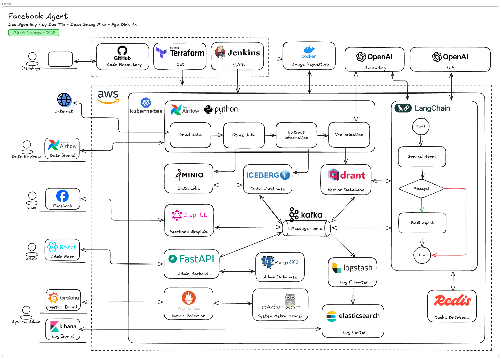

# Facebook Agent Data Pipeline

Project for VPBank Challenge - 2025.

**Team:**
*   Dao Ngoc Huy
*   Ly Duc Tin
*   Doan Quang Minh
*   Ngo Dinh An

## Architecture Overview

This project implements a comprehensive data pipeline to interact with Facebook data. The system is designed to crawl data from Facebook, process it, store it in a data lakehouse, and use it to power a RAG (Retrieval-Augmented Generation) agent.



The full architecture diagram can be found in the `/images` directory.

### Key Components:

*   **Data Ingestion & Orchestration**: Apache Airflow on Kubernetes for orchestrating data crawling pipelines written in Python.
*   **Data Lakehouse**:
    *   **Data Lake**: MinIO for object storage.
    *   **Data Warehouse**: Apache Iceberg for managing large-scale analytical datasets.
*   **Vector Database**: Qdrant for storing embeddings for the RAG agent.
*   **AI & NLP**:
    *   OpenAI models for embedding generation and Large Language Model (LLM) capabilities.
    *   LangChain for building the agentic workflows (General Agent & RAG Agent).
*   **Backend Services**:
    *   FastAPI for the admin backend.
    *   PostgreSQL as the database for the admin backend.
*   **Frontend**: React-based Admin Page.
*   **Messaging**: Apache Kafka as a message queue.
*   **CI/CD & DevOps**:
    *   GitHub for source control.
    *   Terraform for Infrastructure as Code (IaC).
    *   Jenkins for Continuous Integration and Deployment.
    *   Docker for containerization.
*   **Monitoring & Logging**:
    *   **Metrics**: Prometheus, cAdvisor, Grafana.
    *   **Logging**: Elasticsearch, Logstash, Kibana.

## Project Structure

```
.
├── api/                  # FastAPI backend source code
├── docker/               # Dockerfiles for different services
├── images/               # Architecture diagrams
├── lakehouse/            # Data pipeline components (connectors, processors, etc.)
├── settings/             # Project settings and configurations
├── utils/                # Utility scripts and modules
├── docker-compose.yaml   # Docker Compose for local development setup
├── pyproject.toml        # Python project dependencies for Poetry
└── README.md             # This file
```

## Getting Started

### Prerequisites

*   [Docker](https://www.docker.com/get-started)
*   [Docker Compose](https://docs.docker.com/compose/install/)
*   [Poetry](https://python-poetry.org/docs/#installation) for Python dependency management.

### Installation & Setup

1.  **Clone the repository:**
    ```bash
    git clone <repository-url>
    cd vpb25-facebook-agent-data-pipeline
    ```

2.  **Install Python dependencies:**
    Make sure you have Poetry installed, then run:
    ```bash
    poetry install
    ```

3.  **Configure Environment Variables:**
    Create a `.env` file in the root directory and add any necessary environment variables. While many are defined in `docker-compose.yaml`, sensitive keys or environment-specific settings should be placed here.
    ```env
    # Application Settings
    APP_NAME="Facebook Agent Data Pipeline"
    DEBUG=false
    LOG_LEVEL="INFO"

    # GEMINI API Key
    GEMINI_API_KEY=""

    # MinIO Configuration
    MINIO_HOST=localhost
    MINIO_PORT=9000
    MINIO_ACCESS_KEY=minioadmin
    MINIO_SECRET_KEY=minioadmin
    MINIO_SECURE=false

    # Iceberg Configuration
    ICEBERG_CATALOG_URI="http://localhost:8181"
    ICEBERG_NAMESPACE="default"

    # Bucket Names
    STAGING_BUCKET="staging"
    SILVER_BUCKET="silver"
    LAKEHOUSE_BUCKET="lakehouse"
    CRAWLED_BUCKET="crawled"

    # Processing Configuration
    BATCH_SIZE=100
    MAX_FILE_SIZE_MB=50
    MAX_CONCURRENT_PROCESSING=5
    DELETE_AFTER_PROCESSING=false
    ARCHIVE_AFTER_PROCESSING=true
    ```

4.  **Launch the Core Infrastructure:**
    The provided `docker-compose.yaml` file will start the core data lakehouse services (MinIO and Iceberg).
    ```bash
    docker-compose up -d
    ```

5.  **Verify Services:**
    *   **MinIO Console**: Access at [http://localhost:9001](http://localhost:9001) (Use `minioadmin`:`minioadmin`). You should see the `staging`, `silver`, and `lakehouse` buckets created.
    *   **Iceberg REST Catalog**: The service should be running and accessible at `http://localhost:8181`.

### Running the Application

To run the FastAPI backend (currently commented out in `docker-compose.yaml`), you can uncomment the `app` service definition and run `docker-compose up -d --build`.

Alternatively, you can run it locally in a virtual environment managed by Poetry:
```bash
poetry shell
cd api
uvicorn main:app --host 0.0.0.0 --port 8000 --reload
```

## Usage

*   **Admin UI**: Once the backend is running, the React-based Admin Page can be used to interact with the system.
*   **Data Pipeline**: Data pipelines are orchestrated via Airflow. You would typically trigger DAGs from the Airflow UI to start the data crawling and processing jobs.
*   **Facebook Agent**: The agent interacts with users via a messaging interface, leveraging the data in the Qdrant vector database to answer queries.
